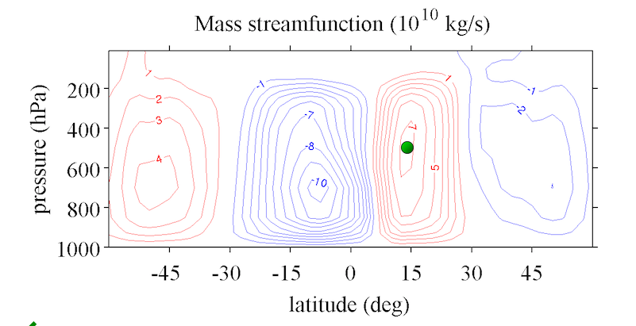

## Problem 1: Hadley Cell

### 1a

The angular momentum $M$ of a parcel on the surface of the Earth at latitude \phi may be expressed,

$$M=a\cos\phi(u+\Omega a\cos\phi)$$


Here $a$ is the radius of the Earth, \Omega is the angular velocity of the Earth's rotation, and $u$ is the velocity of the parcel in the zonal direction.

The angular momentum of a parcel at rest (i.e. when u=0) increases as one moves toward the equator. If the circulation of the atmosphere is zonally symmetric, angular momentum is conserved. Under these conditions the maximum angular momentum achievable by any parcel is that of a stationary parcel at rest at the equator. The maximum velocity of such a parcel at any given latitude is the velocity it achieves if it conserves its angular momentum starting from rest at the equator. Write an expression for this maximum velocity, which we will denote $u_M$, as a function of the latitude $\phi$.

Answer:

The angular momentum for a parcel at rest at the equator is given by,

$$M=a^2\Omega$$

Since we are assuming the parcel conserves its angular momentum, its value of angular momentum must always be equal to this initial value. Thus, we have,

$$a^2\Omega=a\cos\phi\left(u_M+\Omega a \cos\phi\right)$$

Rearranging gives

$$
\begin{align*}
u_M&=a\Omega\left(\frac{1}{\cos \phi}-\cos \phi\right)\\
&=a\Omega\sin\phi\tan\phi
\end{align*}
$$

### 1b
We now consider the radiative-convective equilibrium solution described in the lecture videos. In this solution, the atmospheric winds are in thermal wind balance with the temperature gradient. But is there enough angular momentum on the Earth to sustain such winds?

Suppose the radiative-convective equilibrium solution for the atmospheric temperature is isothermal in the vertical (not realistic!), and has a latitudinal dependence of the form,

$$\ln\left(\frac{T}{T_0}\right) = 1 - \frac{1}{3}\Delta_H\left(3\sin^2(\phi) - 1\right)$$

where $T$ is the temperature, with global mean $T_0$, and $\Delta H$ is the radiative-convective equilibrium temperature difference between equator and pole.

The thermal wind equation may be written

$$2\Omega\sin\phi\frac{\partial u}{\partial z} = -\frac{g}{a}\frac{\partial \ln(T)}{\partial \phi}.$$

Using the expression for $\ln(T)$, find an expression for the zonal velocity at the tropopause, where $z=H$, that is in thermal wind balance with the radiative-convective equilibrium solution for the temperature. We denote this velocity $u_T$. You may assume that the winds at the surface are negligible.

## PROBLEM 2: GEOSTROPHIC BALANCE AND THERMAL WIND

### 2a


The weather map above shows the surface pressure (black lines) over North America, as analyzed for a numerical weather prediction model on February 3, 2014. Based on geostrophic balance, what is the direction of the wind near the surface at the location of the red "X" on the figure?

Answer:  
Northerly

### 2b

The location of the "X" is close to the border of the Canadian state of Manitoba and the Northwest territories. This is at 60. degrees North. You may assume the density of the air near the surface is 1.2 kg/m3, and that the surface pressure at the location of the "X" varies 12 hPa over a distance of 500. km.

Remember to use SI units for all variables, and that the angular rotation velocity of the Earth is 7.29×10???5 s???1.

Answer:  
The geostrophic wind equation is given by,
$$2\Omega v\sin\theta = \frac{1}{\rho}\frac{\partial p}{\partial x}$$
Solving for the meridional wind speed $v$ gives
$$v = \frac{1}{2\Omega\rho\sin\theta}\frac{\partial p}{\partial x}$$.
In this case, we can estimate the horizontal pressure gradient using the finite differences supplied in the problem:
$$\frac{\partial p}{\partial x} = \frac{12\mbox{ hPa}}{500.\mbox{ km}}$$
Plugging this, and the other given parameters into the equation for wind speed gives $v=16 \mbox{ m/s}$.


```{r}
rho=1.2
alpha=1/rho
dpdy=1200/500e3
phi=(pi/180)*60
Omega=7.29e-5
f=2*Omega*sin(phi)

urel=(alpha/f)*dpdy
urel
```

### 2C  

The blue and red contours plotted on the figure above represent the "thickness" of the 1000 hPa - 500 hPa pressure interval-- that is, the vertical distance $\Delta z$ between the 1000 hPa level and the 500 hPa level. On the figure it is expressed in decameters, where 1 decameter = 10 meters.

Use the hydrostatic relation,
$$\frac{d p}{d z} = -\rho g$$
and the ideal gas law,
$$p = \rho R T$$
to express this height difference in terms of the temperature, $T$, gas constant $R$ and gravity $g$. You may assume the temperature to be uniform in the vertical.

Answer:  
Combining the hydrostatic relation and the ideal gas law we have,
$$\frac{1}{p}\frac{d p}{d z} = -\frac{g}{RT}$$
Integrating between the 1000 hPa and 500 hPa isobars,
$$\ln\left(\frac{500}{1000}\right) = -\frac{g\Delta z}{RT}$$
Rearranging,
$$\Delta z = \frac{RT}{g}\ln\left(2\right)$$.

## PROBLEM 3: HEAT TRANSPORT BY EDDIES  

In this problem we consider the transport of energy in the mid-latitudes. We will consider the importance of eddies in this region of the atmosphere, and discuss the concept of eddy transports.

### 3a

The figure below shows the zonal- and annual-mean mass streamfunction for the atmosphere as estimated by what is known as a 'reanalysis'. A 'reanalysis' is constructed thorough the use of a general circulation model in combination with observations to produce a best estimate of the atmospheric circulation. The streamfunction is defined so that the mean circulation follows its contours, and the difference in value between adjacent contours indicates the mass flux between them. On this figure, positive values of the streamfunction correspond to circulation in the clockwise sense.

Mark the position of the center of the Northern Hemisphere Hadley circulation on the figure. This is the position at which there is no mean meridional or vertical motion within the Hadley Cell.



### 3b

The secondary cells shown in the figure exist in the mid-latitudes and are called Ferrel cells. Notice that these circulations point in the opposite direction to the Hadley cells.

Use the figure above to estimate the maximum value of the annual-mean mass flux, in kg/s, of the Southern Hemisphere Ferrel cell. This is the amount of mass that the Ferrel cell moves meridionally through the mid-latitudes in each direction.

Answer
$5\times 10^{10} \text{kg/s}$ - the maximum value in the cell

### 3c

The energy transport by mean overturning cells such as the Hadley and Ferrel cells can be thought of as their total mass flux multiplied by a characteristic difference in the energy content of air moving equatorward compared to air moving poleward,
$$F_E = \overline{M}\cdot\overline{\Delta E}$$
where $\overline{M}$ is the mass flux of the Ferrel cell, and $\Delta \overline{E}$ is the zonal mean energy difference between the upper and lower branches. Here the energy content of the atmosphere may be written,
$$E = c_p T + gz + L_v q$$,
where $c_p$ is the specific heat capacity of air at constant pressure, $T$ is the temperature, $g$ is the gravitational acceleration, $z$ is height in the vertical, $L_v$ is the latent heat of vaporization and $q$ is specific humidity. We have neglected the small contribution of kinetic energy to the total energy in this calculation.

Assume the temperature in the upper branch of the Ferrel cell is 30.0 K colder than the lower branch, while the mean altitude of the upper branch is 8.00 km and the mean altitude of the lower branch is 1.00 km. Finally, assume the lower branch has a mean specific humidity of 0.010 kg/kg, while the upper branch has negligible water vapor. Based on your answer to part B, what is the absolute value of the mean energy transport at mid-latitudes by the Ferrel Cell?


```{r}
cp=1004
g=9.81
Lv=2.5e6

dT=-30
dz=7000
dq=-0.01

dEbar=cp*dT + g*dz + Lv*dq

dEbar
```

This is positive, so upper branch (equatorward) carries more energy than lower branch(poleward)

Hence

$$F_E = \overline{M}\cdot\overline{\Delta E}$$

```{r}
Mbar=5e10
FE=Mbar*dEbar
FE/1e15
```


### 3e

The Ferrel cell represents energy transport by the zonal-mean circulation, but eddies - motions that vary in longitude - can also transport energy.

Consider a flow in which the meridional velocity $v$ has a sinuisoidal dependence on longitude $\theta$,
$$v = v_0\sin(5\theta)$$
Here, $v_0$ is a typical surface wind speed at mid-latitudes which we set to 10.0 m/s. Now, suppose the temperature T also had a sinusoidal dependence on longitude,
$$T = \overline{T} + \Delta T\sin(5\theta)$$
where we set $\Delta T$ to a typical horizontal temperature fluctuation at mid-latitudes of 10.0 degrees Celsius.

The energy flux by such a circulation may be estimated by the integral,
$$F_E^{eddy}=a H\int_0^{2\pi} \rho v\Delta E d\theta$$
where $a$ is the radius of the Earth (6368 km), $\rho$ is the density of air (which we assume to be 1.00 kg/m3), and H is the depth of the circulation, which we take as 5.00 km. The quantity $\Delta E$ is the deviation of the energy content of the atmosphere from the zonal mean. Estimate the heat transport by this circulation assuming the moisture content of the atmosphere does not vary with longitude.

Answer

At a given height level, the deviation of the energy content from the zonal mean may be written,
$$\Delta E = c_p\Delta T \sin{( 5\theta )}$$
Thus, the total eddy energy flux is given by the integral
$$F_E^{eddy}= aH\int_0^{2\pi} c_p v_0\Delta T sin^2{(5\theta)} \, d\theta$$
Evaluating the integral ($=\pi$) we have,
$$F_E^{eddy}= \pi aH c_p v_0\Delta T$$
Substituting the given parameters gives the desired result.

```{r}
a=6368e3
rho=1.0
H=5000
v0=10.0
dT=10.0
cp=1004

F=a*H*rho*v0*cp*dT*pi
F/1e15
```

### 3f

The value found in the above problem is an upper bound, as we assumed the temperature and velocity were completely in phase. Calculate the energy transport in the case where the temperature is not in phase with the meridional velocity, and instead has a cosine dependence on longitude,
$$T = \overline{T} + \Delta T \cos(5\theta)$$

Answer

$$\int_0^{2 \pi} \sin(5\theta)\cos(5\theta) = 0$$

Hence flux is zero. This value is a lower bound.

