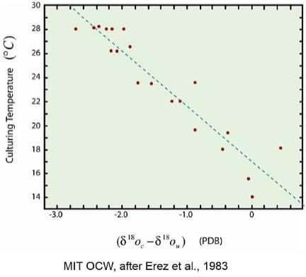

### A little climate physics

#### Problem 2: Equator to pole temperature difference

The annual mean incident solar radiation $I(\phi)$ as a function of latitude $\phi$ is given approximately by

$$I(\phi) = 342 \left(1 - 0.48 \dfrac{(3 \sin^2\phi -1)}{2}\right)$$

```{r}
I<-function(phi){
    342*(1 - 0.48 *(1/2)*(3 *(sin(phi))^2 -1))
}
I(0)
I(pi/2)


albedo<-function(phi){
    albedo<-0.3
}
```
Suppose the atmosphere is transparent to short-wave radiation, but opaque to long-wave radiation. In this case, Ta=Te.

Now,

$$\sigma T_e^4(\phi)=(1-\alpha(\phi))I(\phi)$$

so

$$T_e(\phi) = \left[\frac{(1-\alpha(\phi))I(\phi)}{\sigma}\right]^{1/4}$$


```{r}
Te<-function(phi){
    sigma<-5.670373e-8
    ((1-albedo(phi))*I(phi)/sigma)^0.25
}
```
Hence we can find the atmospheric temperature difference between the equator and pole in radiative equilibrium, 

$$\Delta T_a  = T_a(0^\circ{}) - T_a(90^\circ{})$$

```{r}
Te(0)
Te(pi/2)
Te(0)-Te(pi/2)
```

### The Paleocene-Eocene Thermal Maximum
The current rate of emission of carbon dioxide by humans through fossil fuel use is around 7 Pg of Carbon per year. Suppose during the entire PETM 10 000 Pg of carbon was released into the atmosphere. Assuming this release took 200 thousand years*, what is the ratio of the current emission of carbon through the burning of fossil fuels to the average rate of release of carbon during the PETM?

```{r}
7/(10000/200000)
```

*NOTE: The estimate used here for the timescale over which Carbon was input into the atmosphere during the PETM is based on the duration of the entire event. Modern paleo-climatic studies have suggested the Carbon impulse may have been much shorter in duration - 10,000 years or even shorter. Using this shorter timescale would give a ratio 20 times smaller.

### Oxygen Isotopes and the climate

#### Q1b


Imagine a world in which there are no polar land masses to support ice-caps. Under these conditions the amount of land ice remains small regardless of the temperature. In this ice-free world, the istopes of oxygen in the ocean are measured. For every one mole of $\delta^{16}O$ in the ocean there are 0.002005 moles of $\delta^{18}O$. The oxygen isotopes of a Foraminifera sample from the recent past are also measured. For every one mole of $\delta^{16}O$ in the Foraminifera, there are 0.002000 moles of $\delta^{18}O$.

Now suppose a much older fossilized Foraminifera from the same region of the ocean from a very cool period in the planet's history is found to have a isotopic ratio of $\delta^{18}O$ to $\delta^{16}O$ of 0.0020046. Use the calibration curve shown above to estimate how much cooler the ocean was during the time period when the older fossil was deposited.

```{r}
x<-0.002005
d18Ocean<-1000*(.002005/x-1)
d18Fnow<-1000*(.002/x-1)
d18Fnow-d18Ocean
d18Fthen<-1000*(0.0020046/x-1)
d18Fthen-d18Ocean
d18Fthen-d18Fnow
```

#### Q1c
As was discussed in the videos, the existence of ice caps complicates the interpretation of oxygen isotope records because of the fractionation of water by evaporation and precipitation before it becomes part of the ice cap. As the temperature increases or decreases we might expect the ice cap to grow or shrink. Assuming the ice cap does indeed respond to the temperature change in this way, for a given temperature change would you expect the resultant change in $\delta^{18}O$ of Foraminifera to be larger or smaller with the existence of an ice cap?


### Q 2c to 2f

```{r}
phi=(pi/180)*50
delta=(pi/180)*22
S0=1368

h0=acos(-sin(phi)*sin(delta)/(cos(phi)*cos(delta)))
h0

Imean=(S0/pi)*(sin(phi)*sin(delta)*h0+cos(phi)*cos(delta)*sin(h0))
print (Imean)

Imean=(S0/pi)*cos(phi)*cos(delta)*(-cos(h0)*h0+sin(h0))
print (Imean)
Imean*24/1000
```

### Bare Rock

$$I_{\text{solar}}\pi r_{\text{earth}}^2 \cdot \left ( 1-\alpha)\right)=4\pi r_{\text{earth}}^2 \epsilon \sigma T^4$$

### ESTIMATING THE MEAN TEMPERATURE

```{r}
T1<-c(9.0,9.8,10.1)
mean(T1)

T2<-c(9.0,10.9,9.4,10.9,9.8,9.9,10.6,9.1)
mean(T2)

T3<-c(9.0,10.9,9.4,10.9,9.8,9.9,10.6,9.1,9.3,10.1,9.7,9.6,9.2,10.7,11.0,11.5,9.8,8.9,11.2,10.0)
mean(T3)
```

### SEA LEVEL CHANGE

```{r}
Tw<-c(0,2,4,6,8,10)
rhoSW<-c(1031.364,1031.205,1030.997,1030.763,1030.445,1030.106)
vSW<-1/rhoSW
sw<-data.frame(Tw,rhoSW,vSW)
names(sw)<-c("T","density","v")
plot(sw$T,sw$density,type="b",col="blue",xlab="Temperature (C)",ylab="density kg/m3")
```

#### 2a  
Percentage volume increase on heating from 4 to 8 degrees
```{r}
v8<-sw[which(sw$T==8),3]
v4<-sw[which(sw$T==4),3]
dv<-(v8-v4)/v4
dv
```

#### 2b  
Assuming the ocean depth is on average 4 km, use your previous answer to estimate the global sea-level rise (in meters) for a 4C change in ocean temperature.

```{r}
4000*dv
```

#### 2d  
The total amount of ice in the Greenland ice sheet is estimated to be 2.85 million cubic km.

Assume the Earth's surface is 70% covered by ocean, and that the Earth's radius is 6300 km. How many meters would sea level rise if the entire Greenland ice sheet were to melt?

(You may further assume that the density of ice is 916.9 kg/m3, and that once melted it attains the density of fresh water at 0 C, 1000 kg/m3.)

```{r}
vIce<-2.85e15 #volume of ice m3
rhoIce<-916.9 #density of ice kg/m3
mIce<-vIce*rhoIce # mass of ice
rhoWater<-1000 # density of water kg/m3
vMeltWater<-mIce/rhoWater # volume of melt water
aOcean<-0.7*4*pi*(6300e3)^2 # area of oceans
dh<-vMeltWater/aOcean # increase in sea level
dh
```

### THE MONTREAL PROTOCOL AND CFCS  

The Montreal protocol was an international agreement to limit the production of gases that deplete the ozone layer, signed in 1987. An important class of ozone depleting gases are Chlorofluorocarbons, or CFCs. As well as their ability to destroy ozone in the stratosphere, they are very strong greenhouse gases. In this problem we explore some of the properties of the most common CFCs.  

Consider a simple model for the evolution of the concentation of a certain gas in the atmosphere,  

$$\frac{dC}{dt} = E - \frac{C}{\tau}$$,  

where $C$ is the concentration of the gas [Tg], $E$ is the emission rate [Tg/yr], and $t$ is time [yr]. The time-scale $\tau$ [yr] represents the lifetime of the gas in the atmosphere, before it is removed, either by chemical reactions or deposition to the surface.

#### 3a  
The common CFC Trichlorofluoromethane (CCl3F), also known as CFC-11, has an atmospheric lifetime of approximately 55 years. Suppose that all emission of CFC-11 ceased on January 1, 1988, a few months after the signing of the Montreal Protocol. Using the simple equation given above, find what year the concentration of CFC-11 would be reduced to one-fifth of its concentration at the beginning of 1988.

```{r}
tau<-55
C88<-1
Ct<-function(t,tau,C0){
    C0*exp(-t/tau)
}
dt<--tau*log(0.2)
dt
Ct(dt,tau,1)
dt+1988
```

#### 3b  
Another important CFC is Dichlorodifluoromethane (CCl2F2), or CFC-12. This gas has a longer life-time of 140 years in the atmosphere. Assuming the emission of this gas is also reduced to zero at the beginning of 1988, calculate the concentration of CFC-12 as a fraction of its value in 1988 in the year that was the answer to the previous question. That is, find the concentration of CFC-12 when the concentration of CFC-11 is one fifth of its 1988 value.

```{r}
Ct(dt,140,1)
```

#### 3d  
CFC-11 and CFC-12 are very potent greenhouse gases. Suppose the emission of 1 Tg of CFC-11 causes a 1.0 W m-2 instantaneous perturbation in the radiation budget. The emission of the 1 Tg of CFC-12 causes a 1.5 W m-2 radiative forcing.

The 100 year global warming potential for CFC-11 is estimated to be 4750. Global warming potential is a measure of how much energy would be trapped by the emission of one molecule of a given gas over a specified time period, in this case 100 years, relative to CO2. Global warming potential depends on both the atmospheric lifetime of a gas, as well as its ability to absorb infra-red radiation.

Use the information on the lifetimes and relative radiative forcing strengths of CFC-11 and CFC-12, as well as the global warming potential of CFC-11 to estimate the global warming potential of CFC-12. You may assume that the radiative forcing of each species is simply proportional to its concentration.

Hint: Use the model from part (a) to calculate the total energy absorbed by the instantaneous injection of 1 Tg of each CFC into the atmosphere over 100 years. The ratio of these two energies is the ratio of the global warming potentials.

$$\begin{align*}
C&=C_0 \exp\left(\frac{-t}{\tau}\right)\\
R&=R_0 \exp\left(\frac{-t}{\tau}\right)\\
R_{100}&=R_0 \int_0^{100}\exp\left(\frac{-t}{\tau}\right)~dt\\
&=R_0\tau\left[1-\exp\left(\frac{-100}{\tau}\right)\right ]
\end{align*}$$

```{r}
CFC11_tau<-55
CFC11_rf<-1.0 # Wm-2 per Tg
CFC11_gwp100<-4750 

CFC12_tau<-140
CFC12_rf<-1.5 # Wm-2 per Tg
# average concentration ratio over 100 years
c12c11ratio<-(CFC12_tau/CFC11_tau)*(exp(-100/CFC12_tau)-1)/(exp(-100/CFC11_tau)-1)
CFC12_gwp100<-CFC11_gwp100*c12c11ratio*CFC12_rf/CFC11_rf
CFC12_gwp100
```

See [GHG protocol list of GWPs][id1]

[id1]: http://www.ghgprotocol.org/files/ghgp/tools/Global-Warming-Potential-Values.pdf "GWP list"